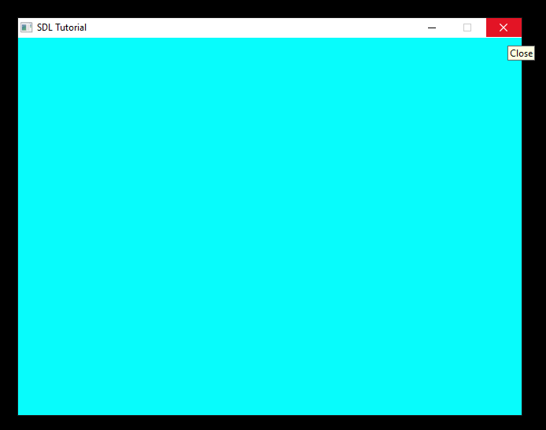
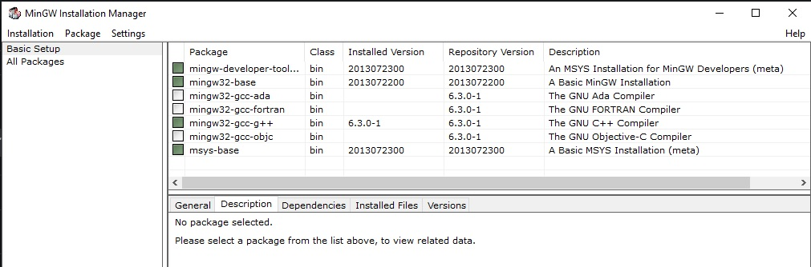

## End Result


This is a basic starting file in C programming language, using SDL2
that
(It's only work on windows, and require Mingw32 to be installed)

## Requirements

- Download and Install [Mingw32](https://www.mingw-w64.org/downloads/),
  then install those packages:
  
- Download [SDL2](https://github.com/libsdl-org/SDL/releases)
- Download [SDL_mage](https://github.com/libsdl-org/SDL_image/releases)

In this project, i'm using the 32 bit version - `i686-w64-mingw32`

## Configuration

You'll find 4 files on the `.vscode` folder :

### 1. c_cpp_properties.json

- Add your current workspace folder
- Add the path to the `SDL2`

```json
"includePath": [
    "${workspaceFolder}/**",
    "C:\\tools\\sdl2-32\\include"
  ]
```

- Specify path to your compiler on the `compilerPath` property,
  here, i'm using gcc from MinGW.

```json
"compilerPath": "C:/MinGW/bin/gcc.exe",
```

### 2. launch.json

- Add `preLaunchTask` property and name it whatever you want,
  you'll refer to it on `label` property on the `tasks.json` file later on.

```json
"preLaunchTask": "SDL2"
```

### 3. settings.json

- In `C_Cpp_Runner.includePaths` property, add the path of the SDL2's `headers` folder

```json
"C_Cpp_Runner.includePaths": [
  "${workspaceFolder}/**",
  "C:\\tools\\sdl2-32\\include"
  ],
```

### 4. tasks.json

- Specify the name of this task on `label` property

```json
"label": "SDL2"
```

- Then add those arguments (linking the `include` and `lib` of the SDL2)

```json
"args": [
  "-fdiagnostics-color=always",
  "-g",
  "${workspaceFolder}\\*.c",
  "-o",
  "${workspaceFolder}\\build\\Debug\\outDebug.exe",
  "-IC:/tools/sdl2-32/include",
  "-LC:/tools/sdl2-32/lib",
  "-lmingw32",
  "-lSDL2main",
  "-lSDL2",
  "-lSDL2_image",
  "-mwindows",
  ""
]
```
